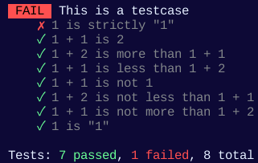

# Testcasekit by willmil11

## Installation
If you have npm and node.js install you can run the following command in a terminal
```bash
npm install testcasekit
```

## Usage
First require the package
```javascript
var testcasekit = require("testcasekit");
```
Then you can create a testcase as so:
```javascript
testcasekit.test("This is a testcase", function(testcase){
    //Then you can test stuff with the following

    //Expect 1 + 1 to be 2
    testcase.expect("1 + 1 is 2", 1 + 1).toBe(2);
    //Expect 1 + 2 to be more than 1 + 1
    testcase.expect("1 + 2 is more than 1 + 1", 1 + 2).toBeMoreThan(1 + 1);
    //Expect 1 + 1 to be less than 1 + 2
    testcase.expect("1 + 1 is less than 1 + 2", 1 + 1).toBeLessThan(1 + 2);
    //Expect 1 + 1 to not be 1
    testcase.expect("1 + 1 is not 1", 1 + 1).not.toBe(1);
    //Expect 1 + 2 to not be less than 1 + 1
    testcase.expect("1 + 2 is not less than 1 + 1", 1 + 2).not.toBeLessThan(1 + 1);
    //Expect 1 + 1 to not be more than 1 + 2
    testcase.expect("1 + 1 is not more than 1 + 2", 1 + 1).not.toBeMoreThan(1 + 2);
    //Expect 1 to be "1"
    testcase.expect("1 is \"1\"", 1).toBe("1");
    //Expect 1 to strictly be "1"
    testcase.expect("1 is strictly \"1\"", 1).toStrictlyBe("1");

    //Finish the test
    testcase.finish();

    //Now the test result will appear in the console if a testcase is failed the test will apppear as failed but if all testcases passed the test will appear as passed.
})
```
### Output exemples
Failed testcase
<br>

<br>
Passed testcase
<br>


## Github
### Repo link
<a href="https://github.com/willmil11/Testcasekit">https://github.com/willmil11/Testcasekit</a>
### Bugs
If you find any bugs please report them on the github repo bugs tab (<a href="https://github.com/willmil11/Testcasekit/issues">https://github.com/willmil11/Testcasekit/issues</a>)

## Contact me
If you have any questions or suggestions you can contact me on discord: willmil11#8988
<br>
I have an email too: willmil1110@gmail.com

## Credits
No credits lol